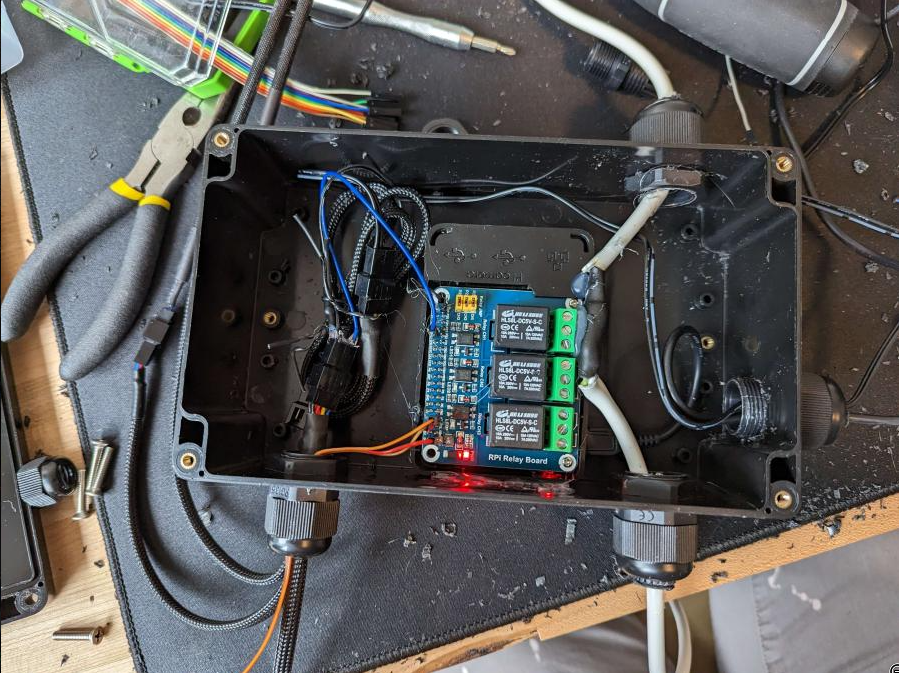
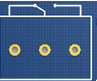
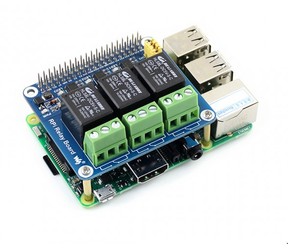
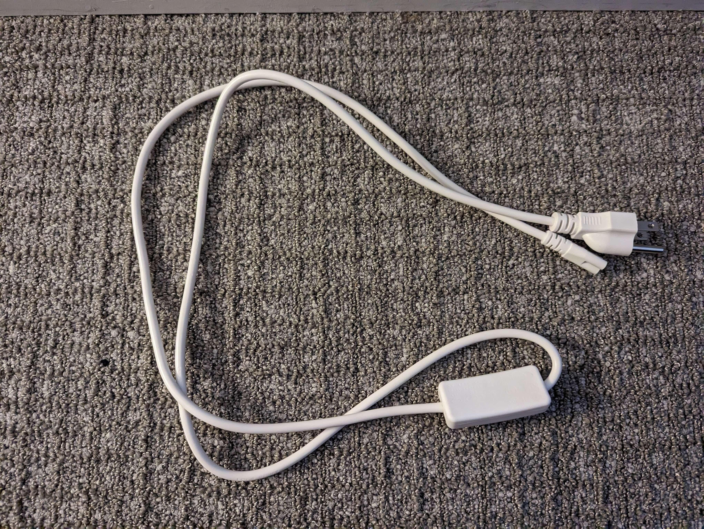
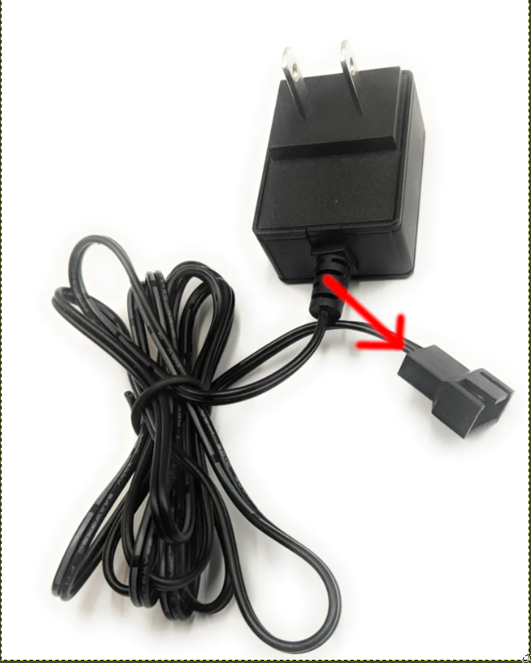

# Hardware

The main part of this project is wiring all the hardware so the Raspberry Pi can control
everything.

Our Pi is going to control the 2 NF-F12 fans and 2 of the full spectrum grow lights. We
will control the fans via PWM and the lights via our relay board, which is controlled
over GPIO.

## Safety

Setting up this hardware involves wiring with mains electrical power. I take no 
responsibility for injury or death that may occur from following this guide. When
working with any electrical power, it is extremely important to remain cautious and
vigilant at all times but particularly so with mains power. Never ever touch exposed
hot contacts and always ensure your project box is closed when testing or using the
power relay. Wear sturdy rubber gloves and use a GFCI when working with this project.

With all that said, I have done this process exactly as outlined here and it works great
and safely. Use common sense and let's get started!

# Final Circuit

We're going to build everything inside our project box, where we'll end up with
something this:

```text
                               Pi GPIO
                  +--------+          +-------------------------+
                  |        |          |                         |     GPIO 12+-------+
+---------+       |      +-+----------+------+                  +------------+       |
|         | GND   |      |                   |                    Shared GND |  Fan  |
|         +-------+      +--+--------------+-+----------------------+--------+Splitter
|         |GPIO 4        |  |              |GPIO 26                 |    12V |       |
|DHT22    +--+-----------+  |              |(Thru Standoff)         |   +----+       |
|         |  |10kOhm        |              |                        |   |    +-------+
|         +--+--------------+              |                        |   |
|         |+3.3v                           +-------+                |   |
+---------+                                        |                |   |
                                     Relay CH1     |                |   |
                                     +------+      |                |   |
                                     |N C  N|      |                |   |
                                     |O O  C+------+                |   |
                                     ++-+---+                       |   |
                                      | |                          1|   |1
                                      | |                          2|   |2
                                      | |                          V|   |V
                                      | |                          D|   |D
                +--------+            | |120VAC Hot                C|   |C
                |        +------------+ +------------               |   |
                |        |               120VAC Neutral            G|   |P
                |Light   +---------------------------              N|   |O
                |        |               120VAC Ground             D|   |S
                |        +---------------------------             +-+---+--+
                +--------+                                        | 12V    |
                                                                  |Fan Pwr |
                                                                  |        |
                                                                  +--------+

```

# Preparing Your Project Box

Your project box may be different from mine, but in general you should have some
sort of plastic enclosure that won't shock you. You should also have cable glands and
a drill for drilling holes to add them to your project box. How you drill these holes
specifically is up to you, but you should drill these holes and add the cable glands *before* attaching any wires inside the box.

This is what my final box
looks like:



From top left moving clockwise around the box, the first cord is from the wall plug for
the lights, the next is the 5v and 12v input wires for the Raspberry Pi power and the
fan power, respectively. The third is the cord going *to* the lights, and finally the
fourth is the GPIO wires for the temp/humidity sensor and the splitter to power and
control the fans.

# Wiring the Lights

First thing we are going to do is wire up the lights. This is the only sketchy part, the
other components don't need mains power, but this does. If you prefer to buy a smart
switch and control it via the Pi, go for it! This works nicely though and is easy to
program, so it's really up to you. Take note of the safety disclaimer in the README.
That applies here in particular, you take responsibility for your own safety!

## Relays Background

You can read the documentation for the WaveShare relay board we are using
[here](https://web.archive.org/web/20230410023225/https://www.waveshare.com/wiki/RPi_Relay_Board).

Relays of the type we are using have one or more channels (in our case, three) each of
which is connected to our Raspberry Pi's GPIO header via one GPIO pin for control, one
positive pin, and one ground pin. On this board in particular (the WaveShare 3CH RPi
Relay Board) the three GPIO pins are 26, 20, and 21 for Channels 1, 2, and 3
respectively. You can think of these inputs to the board as the "control plane".

On the other side, with the green plastic shields and screwdown inputs, are the AC
inputs. Each channel has three holes: Normally Closed (NC), Normally Open (NO) and
Common (COM). On the waveshare board, these holes are labeled with a diagram that
looks like this:



From left to right in this image, the three holes as labeled are NC, COM, and NO.

NC and NO do exactly what they sound like. "Normally Closed" means that the default
state for the circuit passing through the NC and COM inputs is *closed*, or *on*. Likewise
NO means the default state of the circuit is *open* or *off*. When the input is set
via the GPIO pin for a given Channel, the state of the circuit is toggled to the other
state, so a hot wire that goes in the COM input and out the NO input that defaulted to
open will now be closed and whatever is attached to that wire will turn on.

## Step 1: Plug in Relay HAT

The first thing you'll want to do is plug the relay HAT into your Raspberry Pi. The
40 pin GPIO header passthrough should plug right into your Raspberry Pi's GPIO header
and the relay board should sit right on top like this:



## Step 2: Isolate Hot Wire

It should go without saying, but all steps from now until we test this circuit should
be done with the entire system *unplugged* from the wall.

Next, you'll have two wall cords and 4 bridge cords that come with the grow lights. One
of the wall cords will be our donor cord (we're gonna cut it up). That cord looks like
this:



Inside this cord are three wires:

- Black (hot)
- White (neutral)
- Yellow/Green (ground)

The only wire we need is the black (hot) wire, so you have a couple options on how to
chop the cord.

### Option 1: Cut all the way and reconnect

Option 1 (this is what I did) is to cut clean through the entire power cord. After
cutting through it, you'll need to solder the neutral and ground wires from the two
halves back together and protect the joint with heat shrink. You'll then have one wire
with a cut hot lead. 

### Option 2: Cut only the hot lead

Option 2 is to snip carefully around the plastic sheathing on the cord until you can
get at *only* the hot wire. Cut the hot wire, leaving the other two intact.

## Step 3: Connect Power Cord

Once you have isolated the hot wire and have the neutral and ground wires connected up,
whichever option you choose, you will need to connect the hot wire to the relay.

Pass the cord with the two leads of the hot wire exposed into the project box through
two cable glands positioned on opposite sides of the box. You don't *have* to have all
the other holes drilled and cable glands added at this point, but it may make your
life easier. Inside the box, attach the hot wire lead on the side of the cord closest
to the wall plug to the COM port of Channel 1 of the relay. Plug the wire in all the
way and screw the screw on top of the port down hand tight. Wiggle the wire to ensure it
will not pop out unexpectedly. Next, attach the lead on the side of the cord closest to
plug that will plug into the lights to the NC input of the relay. Screw the port down
tight.

## Step 4: Test The Lights

__NOTE__: This step is dangerous! We are plugging in a chopped up cord to mains power.
Double check your connections and make sure you are not touching *anything*.

Create a script with the following contents in `/tmp/test-lights.sh` on your Raspberry
Pi.

```sh
#!/bin/bash

echo 26 > /sys/class/gpio/export
echo out > /sys/class/gpio/gpio26/direction
echo 0 > /sys/class/gpio/gpio26/value

sleep 5

echo 1 > /sys/class/gpio/gpio26/value
```

Make the script executable with `chmod +x /tmp/test-lights.sh`.

Put your rubber gloves on! Plug the lights side of the power cord into one of the four
light strips and place the light on your workbench. Next, plug the wall end of the plug
into the wall plug with your GFCI. *Nothing should happen*. Step away from the assembly and
run the script with `sudo /tmp/test-lights.sh`. The lights should turn on, and 5 seconds
later the lights should turn off.

__Unplug the lights power cord from the wal!__

After unplugging the lights cord from the wall, unplug it from the light strip as well.
Congratulations, the lights are done! We will not plug in the lights power until after
we seal everything back up.

## Step 5: Hot Glue The Lights Cord

Bust out your hot glue gun and hit the relay connection with some hot glue so it doesn't 
fall out. More is more, don't worry about over-gluing. Take a look at [the overview](#preparing-your-project-box) to see how I glued it.

# Wiring the Fans

## Step 1: Connect GPIO to Fan Splitters

We need to connect two wires to one of our fan splitters.

1. GND to GND. The fan splitter should have four wires: Black (GND), Yellow (+12V),
   Blue (PWM), Green (Sense). Solder a jumper wire to the GND wire of the fan splitter.
2. GPIO 12 to PWM. Solder a jumper wire to the PWM wire of the fan splitter.

The easiest way to do this is to solder the GND wire to the GND wire at the bottom of
the fan power supply to fan connector:



You can pull the wires out of the bottom of this connector to expose the pin attachments
on the bottom, and you can solder your jumper wire to the bottom of this connector.

Your jumper wires probably have plastic casings on them, which you can break with your
needle nose pliers to expose a similar metal pin. You can shove this metal pin in the
empty connector slot in the fan connector, re-insert the positive and ground pins, and
you are ready to plug in and control your fans with your Raspberry Pi.

Plug one fan splitter into the fan power connector, then attach the GND jumper wire to
the GND pin on the GPIO header. Plug the PWM jumper wire into the GPIO 4 pin on the
Pi.

Plug your 2 fans into 2 of the split fan outputs from the splitter.

## Step 2: Test the Fans

Create a new rust project to test the fans:

```sh
$ cd ~
$ cargo new --bin test-fans
$ cd ~/test-fans
$ cargo add rppal
```

Edit `~/test-fans/src/main.rs`:

```rust
use rppal::pwm::{Pwm, Channel, Polarity};
use std::{thread::sleep, time::Duration};

fn main() {
    let fan_pwm = Pwm::with_frequency(
        Channel::Pwm0,
        25_000.0,
        0.00,
        Polarity::Normal,
        true
    ).expect("Could not initialize pwm");

    sleep(Duration::from_secs_f32(3.0));

    fan_pwm.set_duty_cycle(0.5);

    sleep(Duration::from_secs_f32(3.0));

    fan_pwm.set_duty_cycle(1.0);

    sleep(Duration::from_secs_f32(3.0));

    fan_pwm.set_duty_cycle(0.0);


}
```

Plug the fan power supply in (no need for gloves, but make sure the lights power is
still unplugged). Build and run the fan test program with `cargo run`. The fan should
stop, then go to 50%, then go to 100%, then stop again.

# Wiring the Humidity/Temperature sensor

Finally, we'll wire up the DHT22 sensor.

## Step 1: Attach wires to Raspberry Pi

We'll take three jumper wires and attach them to the 3.3v, GND, and GPIO 4 pin. Connect
a 10k Ohm resistor between the 3.3v and GPIO 4 jumper wires, then connect the three
wires to the three wires on the DHT22 sensor. You can use a breadboard (I did) or solder
the wires and resistor.

## Step 2: Test The DHT22 Sensor

Create a new rust project to test the fans:

```sh
$ cd ~
$ cargo new --bin test-sensor
$ cd ~/test-sensor
$ cargo add dht22_pi
```

Edit `~/test-sensor/src/main.rs`:

```rust
use dht22_pi::{read as dht22_read, Reading};
use std::{thread::sleep, time::Duration};

fn main() {
    for _ in 0..3 {
        if let Ok(reading) = dht22_read(4) {
            println!(
                "Reading: temp {}C humidity {}%",
                reading.temperature,
                reading.humidity
            );
        }

        // You can't read from the sensor more than every 2s
        sleep(Duration::from_secs_f32(3.0));)

    }
}
```

Build the program with `cargo build` and run it with `sudo ./target/debug/test-sensor`
you should see 3 readings.

# Wrap up the Hardware

We're done wiring up the hardware, close up that box!
